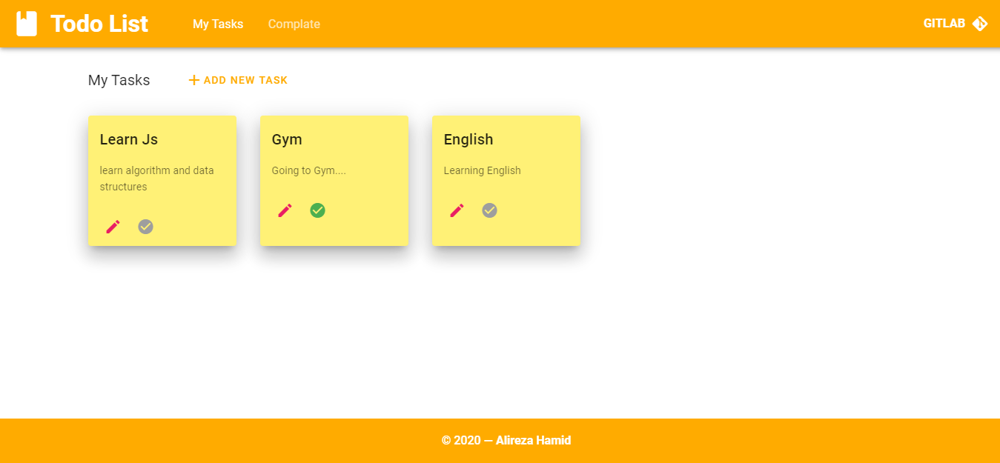

# Amazing todo list app




## Project setup
### 4 Steps To Run Endpoint

:fork_and_knife: 1- you need clone this repository [NodeJs-CURD](https://duckduckgo.com). <br><br>


:rocket: 2- go to **NodeJs-CURD** project path and run this command :
```
npm install
``` 
<br>

:dart: 3- make sure of install Mongodb in your local system and run this command :
 ```
 mongod – dbpath {path}

 ``` 
 <br>
 
:checkered_flag: 4- after that back to **NodeJs-CURD** and run this command :
```
npm start
```

:triangular_flag_on_post: **Endpoint** start on port 3000
<br><br>
# Run Todo Application
:white_check_mark: 1- Clone this project <br><br>

:white_check_mark: 2- Run this command : 
```
npm install
```
### Compiles and hot-reloads for development
```
npm run serve
```

### Compiles and minifies for production
```
npm run build
```

### Lints and fixes files
```
npm run lint
```

### Customize configuration
See [Configuration Reference](https://cli.vuejs.org/config/).
